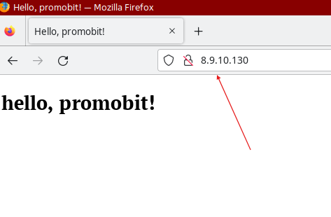

# Тестовое задание для Промобит на позицию - Инженер по внедрению программно-аппаратного обеспечения

## Инструкция по использованию

1. Во избежании конфиликтов проверить доступность пакетов ansible и nginx на сервере ansible и клиенте соотведственно командой - `apt-cache packache_name`

2. Скокировать командой `git clone` удаленный репозиторий, в результате получить следующую структуру проекта

```plaintext
ansible-promobit
├── inventory.ini
├── ping.retry
├── ping.yml
├── roles
│   └── nginx
│   ├── defaults
│   ├── files
│   │   └── index.html
│   ├── handlers
│   │   └── main.yml
│   ├── tasks
│   │   └── main.yml
│   ├── templates
│   │   └── nginx.conf.j2
│   └── vars
├── site.retry
└── site.yml
```

3. Заменить данные о достпуных вебсерверах на тестируемые в файле `inventory.ini`.

4. Запустить задание автоматизации ansible командой - `ansible-playbook -i inventory.ini site.yml`

5. По завершению пункта 4, отправив запрос `curl http://web_server_ip`, получив:

```html
<!DOCTYPE html>
<html lang="en">
  <head>
    <meta charset="UTF-8" />
    <meta name="viewport" content="width=device-width, initial-scale=1.0" />
    <title>Hello, promobit!</title>
  </head>
  <body>
    <h1>hello, promobit!</h1>
  </body>
</html>
```

Также в браузере получить следующий вывод, стрелкой показан IP адрес веб сервера с NGINX:


